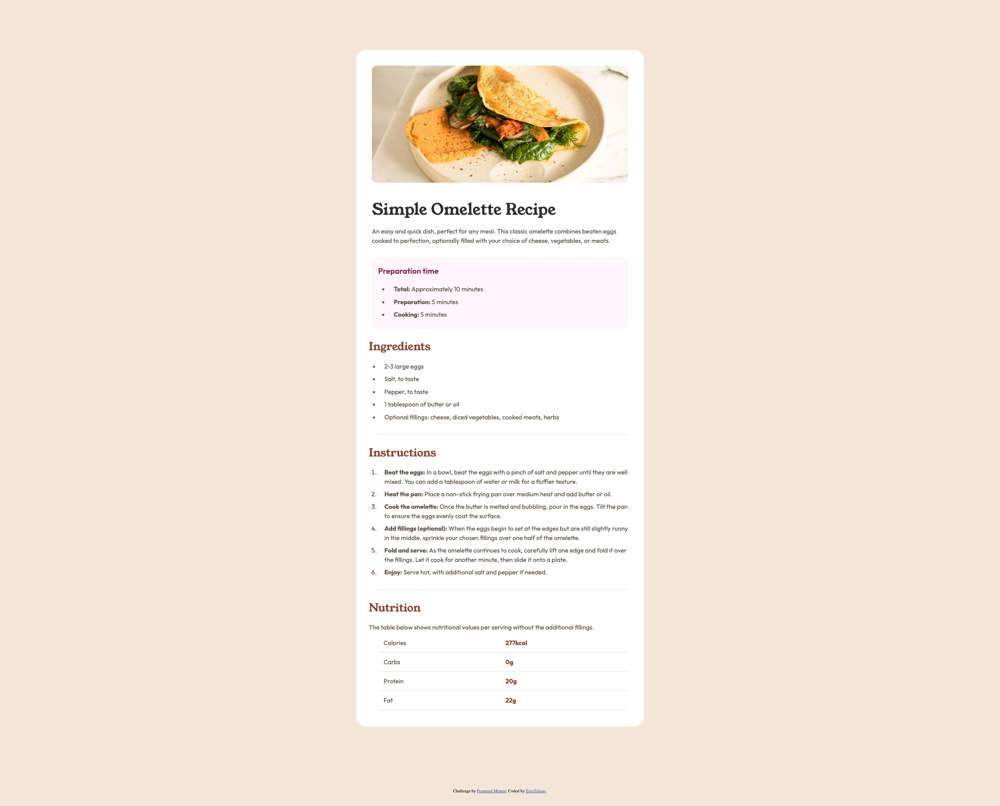

# Frontend Mentor - Recipe page solution

This is a solution to the [Recipe page challenge on Frontend Mentor](https://www.frontendmentor.io/challenges/recipe-page-KiTsR8QQKm). Frontend Mentor challenges help you improve your coding skills by building realistic projects. 

## Table of contents

- [Overview](#overview)
  - [The challenge](#the-challenge)
  - [Screenshot](#screenshot)
  - [Links](#links)
- [My process](#my-process)
  - [Built with](#built-with)
  - [What I learned](#what-i-learned)
  - [Continued development](#continued-development)
  - [Useful resources](#useful-resources)
- [Author](#author)


## Overview

### Screenshot



### Links

- Solution URL: [Add solution URL here](https://your-solution-url.com)
- Live Site URL: [Add live site URL here](https://your-live-site-url.com)

## My process

### Built with

- Semantic HTML5 markup
- CSS custom properties
- Flexbox
- Mobile-first workflow

### What I learned

Learned how to implement mobile first design. Added some @media queries for different screen sizes. Also learned about tables in CSS.

Code snippets, see below:

```css
@media (min-width: 90rem) {
    .container {
        width: 46rem;
        flex-shrink: 0;
    }
}
```

### Continued development

Would like to take on more complex projects with multiple pages or modals before adding some JS in future.

## Author

- Website - [@Zerotekniq](https://github.com/ZeroTekniq)
- Frontend Mentor - [@ZeroTekniq](https://www.frontendmentor.io/profile/ZeroTekniq)

